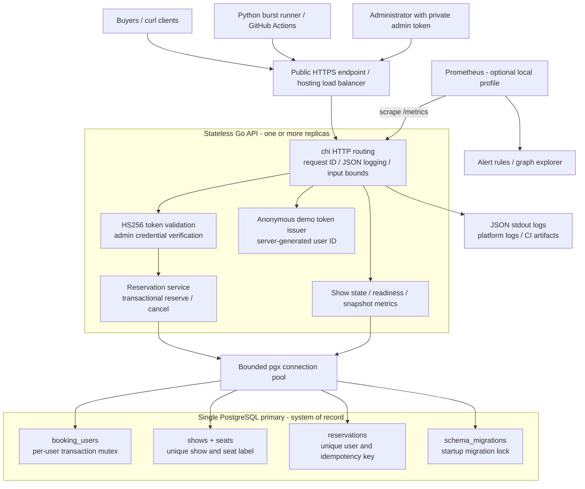

# Seat Reservation at Scale

Go + PostgreSQL JSON API for the Paytm backend take-home. Assigned seats, atomic all-or-nothing reservations, per-user limits, idempotency, owner-only cancellation, health checks, Prometheus metrics, and structured logs.

**Submission status:** source, tests, deployment configuration, and load harness are included. A public deployment and a successful live burst are still required. Do not treat a generated repository or a passing unit test as evidence of 20,000-client capacity. No live URL or successful live-load results have been fabricated.

## HLD Architecture



There is no cache, distributed lock service, payment gateway, or expiry worker. The database owns every booking decision. Additional API replicas must share the same primary and auth configuration. See [WRITEUP.md](WRITEUP.md) for the precise lock order, failure semantics, and trade-offs.

## Run on a MacBook Air

Supported container targets are `linux/arm64` (Apple silicon) and `linux/amd64` (Intel). Docker Desktop runs the Linux containers on macOS; native Go or PostgreSQL installation is not required. CI is configured to build both architectures, but neither a Mac runtime nor Docker was available in the development workspace for local verification.

1. Install and start [Docker Desktop for Mac](https://docs.docker.com/desktop/setup/install/mac-install/), choosing the download matching your processor. Use a current Docker Compose v2 supporting `--wait`. Allocate roughly 4 GB RAM for development and enough disk for images.
2. Clone this repository and start the service:

```bash
git clone https://github.com/tanveer-shaikh-90/Project.git
cd Project
docker compose up --build --wait --wait-timeout 180
curl --fail http://localhost:8080/health/ready
```

Expected response: `{"status":"ready"}`. This is an API, not a website; `/` returning JSON 404 is normal. Local Compose binds the API to loopback and keeps the database off the host network. The schema is installed automatically on boot. No manual SQL step is needed.

If port 8080 is occupied:

```bash
HTTP_PORT=8081 docker compose up --build --wait
curl --fail http://localhost:8081/health/ready
```

Compose uses documented **local-only** auth credentials by default. Do not expose those credentials on a public deployment. PostgreSQL data persists in the named `pgdata` volume.

## Test With Docker Only

Run the real PostgreSQL integration tests and Go race detector:

```bash
docker compose --profile tools run --build --rm test
```

Run a small HTTP smoke/contract check:

```bash
docker compose --profile tools run --build --rm load python scripts/burst.py http://api:8080 --smoke
```

Run the full burst, without installing Python locally:

```bash
docker compose --profile tools run --build --rm load
```

The default burst uses 500 maximum in-flight connections and 20,000 **spread requests**, plus a 500-user hot-seat storm, 500 same-key retries, a parallel limit test, and cancellation/ownership checks. It pre-issues signed user tokens. A total of 20,000 requests is **not** the same thing as 20,000 simultaneous network connections.

To attempt 20,000 in-flight connections on suitably provisioned infrastructure:

```bash
docker compose --profile tools run --rm load python scripts/burst.py http://api:8080 --total 20000 --hot-users 20000 --concurrency 20000
```

This may exceed a laptop, hosting proxy, OS file-descriptor limit, or free database tier. Connection failures and 5xx count as failures, not successful declines. Provision and measure before claiming that capacity.

Expected contract outcomes:

| Scenario | Required result |
| --- | --- |
| Fresh hot seat, 500 users | 1 HTTP 201 and 499 HTTP 409 `seat_taken` |
| Same user/key/body, 500 requests | 1 HTTP 201 and 499 HTTP 200, one reservation ID |
| One user, 10 distinct seats, default limit 4 | 4 HTTP 201 and 6 HTTP 409 `per_user_limit` |
| Changed seats on a successful key | HTTP 409 `idempotency_conflict` |
| Multi-seat request containing a taken seat | No partial change |
| Non-owner cancellation | HTTP 403 |
| Cancel, rebook, repeat old cancel | New owner's seats remain confirmed |
| Reconciliation and metrics | Counts, physical labels, responses, and final gauge agree |

The harness samples show state during load, checks response identity and money, prints reason counts and p50/p95/p99 client latency, and exits **1** on failure. Do not run Python with `-O`, which disables assertions; the CLI rejects it.

## Test Without This Laptop

After pushing the corrected files, open the repository's **Actions** tab. [The CI workflow](.github/workflows/ci.yml) runs automatically on pushes and pull requests:

- PostgreSQL 16 integration tests, repeated concurrency tests, Go vet, and the race detector.
- Python harness unit tests.
- Clean Docker build/start, smoke check, restart persistence check, and a 20,000-request burst at 500 maximum in-flight connections.
- AMD64 and ARM64 container builds.
- Prometheus rule validation and downloadable logs, metrics, and JSON reports.

Wait for **both** `contracts` and `container-platforms` jobs to pass. The database test intentionally skips if `TEST_DATABASE_URL` is absent locally; CI always sets it. A skip is not a concurrency pass. CI has not been executed merely by adding the workflow.

## API and Authentication

Public endpoints: `POST /auth/token`, `GET /shows/{id}`, `/health/live`, `/health/ready`, `/metrics`.

`POST /auth/token` creates an anonymous demo identity with a random server-generated `user_id` and a signed bearer token valid for 24 hours. Save and reuse that token for the same user. Clients cannot choose the subject or admin role. This is a demo registration endpoint, not a production login system: multiple registrations create multiple users. A production identity provider and abuse controls are out of scope.

Local example (requires `curl` and Python 3 for JSON extraction):

```bash
export BASE_URL=http://localhost:8080
export ADMIN_TOKEN=local-admin-credential-not-for-production-12345
TOKEN=$(curl --fail -sS -X POST "$BASE_URL/auth/token" | python3 -c 'import json,sys; print(json.load(sys.stdin)["token"])')

SHOW_ID=$(curl --fail -sS -X POST "$BASE_URL/shows" \
  -H "Authorization: Bearer $ADMIN_TOKEN" -H 'Content-Type: application/json' \
  -d '{"name":"friday-night","seats":["A1","A2","A12"],"price_paise":25000}' \
  | python3 -c 'import json,sys; print(json.load(sys.stdin)["id"])')

curl -i -X POST "$BASE_URL/shows/$SHOW_ID/reserve" \
  -H "Authorization: Bearer $TOKEN" -H 'Content-Type: application/json' \
  -H 'Idempotency-Key: alice-booking-1' -d '{"seats":["A12"],"user_id":"ignored"}'
curl --fail "$BASE_URL/shows/$SHOW_ID"
```

Repeat the reserve command for HTTP 200 with the original reservation ID. A fresh booking is HTTP 201 with `reservation_id`, `show_id`, `user_id`, `seats`, integer `amount_paise`, and `status: confirmed`.

| Method / endpoint | Access / behavior |
| --- | --- |
| `POST /shows` | Admin token; name, distinct seats, integer price; optional `per_user_limit` defaults to 4; returns all available seats |
| `POST /shows/{id}/reserve` | Signed user token; nonempty `seats`; idempotency key in header or body; header takes precedence |
| `POST /reservations/{id}/cancel` | Owner only; HTTP 200, including repeated cancellation; releases all seats atomically |
| `GET /shows/{id}` | Public; per-seat state, counts, and total |
| `GET /health/live` | HTTP 200 while process is serving |
| `GET /health/ready` | Database ping; HTTP 503 when unreachable or pool cannot serve it within two seconds |
| `GET /metrics` | Prometheus exposition; fails the scrape on database error, never invents zero availability |

Cancel using the returned reservation ID:

```bash
curl -i -X POST "$BASE_URL/reservations/REPLACE_WITH_RESERVATION_ID/cancel" \
  -H "Authorization: Bearer $TOKEN"
```

The model is immediate confirmation with explicit cancellation, not expiring holds. `held` remains zero. A retry of a cancelled reservation returns the same ID with **current status `cancelled`**, never a new booking. Use a new key to rebook. Successful keys are scoped to the user across shows; a key used for a different show conflicts. Seat order is ignored; duplicates and blank/padded labels are rejected. Failed attempts are not cached and can be retried, including after seat availability changes. No external payment is performed; the amount is a reservation ledger value.

Limits: 2 MiB body, 10,000 seats per show/request, 100-byte seat labels, 200-byte names/keys, positive limit at most 10,000. Invalid UUIDs, fractional/overflowing prices, or invalid input get HTTP 400; nonexistent resources get 404; domain conflicts get 409. Database outages/timeouts remain real 5xx, not disguised seat declines. Retry an uncertain write with the **same key**.

## Deploy and Test a Public URL

1. Push the corrected repository. In Render, select **New > Blueprint** and choose this repository's [render.yaml](render.yaml).
2. Review current pricing and availability before approving resource creation. The blueprint requests free web/PostgreSQL plans; free instances can sleep, databases may expire, and limits may change. Use persistent paid resources if needed for the evaluator's availability/load window. No free-tier capacity is promised.
3. Render builds the Dockerfile, injects `DATABASE_URL`, and generates independent `AUTH_SECRET` and `ADMIN_TOKEN` values. The readiness path is `/health/ready`. Keep secrets private and stable across restarts/replicas.
4. Confirm the public HTTPS `/health/ready` endpoint. Keep the service and database alive until evaluation is finished.
5. Add the deployed `ADMIN_TOKEN` privately under GitHub **Settings > Secrets and variables > Actions > New repository secret**, named `ADMIN_TOKEN`. Never put it in source, screenshots, chat, or the write-up.
6. In **Actions > Verify seat reservation > Run workflow**, enter the deployed `base_url` and desired concurrency. Download `live-burst-evidence` after completion. This runs from GitHub, not this laptop.
7. Review Render's live logs while the test runs and record a short screen recording if public log access is unavailable. CI's local Compose logs are **not** evidence of the public deployment.

Manual live test on any machine with Python 3.12+:

```bash
python3 -m venv .venv
source .venv/bin/activate
python -m pip install -r scripts/requirements.txt
# Set ADMIN_TOKEN privately in this shell to the deployed value.
python scripts/burst.py https://YOUR-SERVICE.onrender.com --report live-burst.json
```

Before sending the submission, provide: public repo URL, exact commit, live base URL, metrics URL, burst command and genuine report, live log access/recording, and [WRITEUP.md](WRITEUP.md). Share any required admin test credential only through an agreed private channel. There is no need to share `AUTH_SECRET`.

## Observe and Diagnose

```bash
docker compose --profile observe up -d prometheus
docker compose logs -f api
curl --fail http://localhost:8080/metrics
```

Prometheus graph/alerts UI: `http://localhost:9090`. [Alert rules](observability/alerts.yml) cover reserve 5xx, failed scrapes, reconciliation, and high latency. Notification delivery requires an Alertmanager/receiver; rules alone do not page a person.

- `reservations_confirmed_total`: database-backed lifetime reservation count, including subsequently cancelled records; stable across API restarts.
- `reservations_declined_total{reason}`: process-local counter for `seat_taken`, `per_user_limit`, `idempotency_conflict`, and `idempotent_replay`. Replay is HTTP 200, tracked here to meet the assignment's requested reason breakdown, not a failed booking.
- `seats_available{show_id}`, `seats_state{show_id,status}`, `seats_total{show_id}`: one database statement snapshot per scrape.
- `http_requests_total{route,method,status}` and latency histogram: numeric status labels and bounded route templates, not per-ID routes.

Do not sum database-backed gauges/counters across replicas: each replica observes the same database. Use `max` by show for database gauges and sum **rates** for per-process HTTP/decline counters. Two different-time scrapes/API reads can legitimately differ during writes; compare after quiescence or within a snapshot. Per-show metric cardinality grows with shows; retention is a future operational task.

Failure drill (local only):

```bash
docker compose stop db
curl -i http://localhost:8080/health/live
curl -i http://localhost:8080/health/ready
docker compose start db
curl --retry 10 --retry-all-errors --retry-delay 1 --fail http://localhost:8080/health/ready
```

Live should remain 200; ready should become 503, then recover. Under excessive load, pool waits can also fail readiness; tune infrastructure from evidence. Requests are bounded at 180 seconds, not queued forever.

## Development and Files

Optional native development requires Go **1.26+** (Docker/CI use 1.27.1) and PostgreSQL 16. Use [.env.example](.env.example) for a local configuration, set a reachable database URL, then `go run ./cmd/api`. Compose's DB is intentionally not published; native mode needs its own reachable database. Run `go test ./...` for unit tests and set `TEST_DATABASE_URL` to run integration tests. Tests create and drop an isolated schema, not application data.

| Path | Responsibility |
| --- | --- |
| [cmd/api/main.go](cmd/api/main.go) | Configuration, migration, server lifecycle |
| [internal/service/reservation.go](internal/service/reservation.go) | Transaction decisions and validation |
| [internal/db/migrations.sql](internal/db/migrations.sql) | Schema and integrity constraints |
| [internal/api/server_test.go](internal/api/server_test.go) | Auth and PostgreSQL concurrency contracts |
| [internal/metrics/metrics.go](internal/metrics/metrics.go) | HTTP counters and database snapshot collector |
| [scripts/burst.py](scripts/burst.py) | Live smoke, stampede, and evidence harness |
| [docker-compose.yml](docker-compose.yml) | Local API, DB, tests, load, monitoring |
| [.github/workflows/ci.yml](.github/workflows/ci.yml) | Remote verification and optional live burst |

Stop without deleting bookings: `docker compose --profile observe down`. Only for disposable development data, `docker compose down -v` also deletes the database volume. Builds use the tracked [go.sum](go.sum); they do not run `go mod tidy` or silently ignore dependency failures.